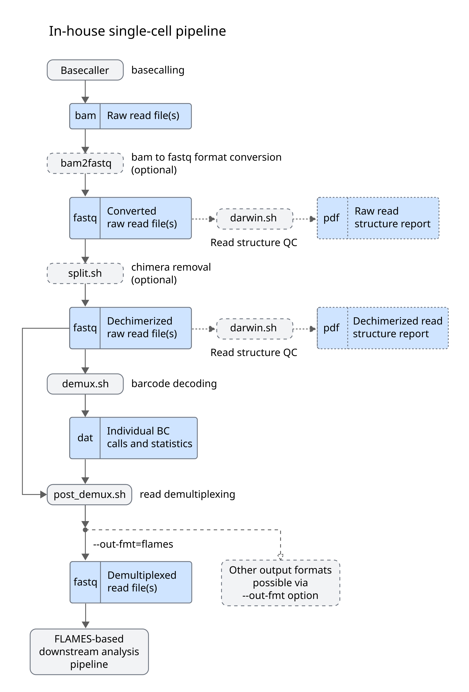
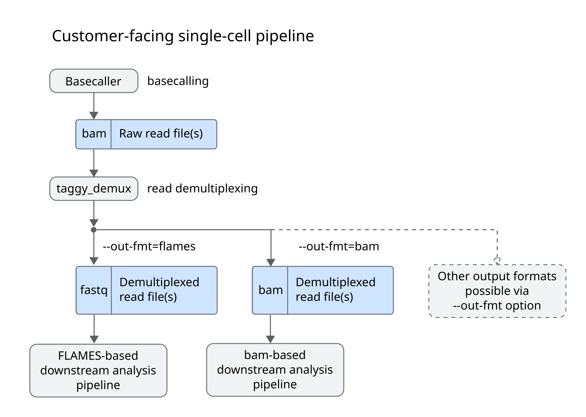

# ArgenTag single-cell read demultiplexing pipelines

Demultiplexing refers to the process of identifying the barcode(s) that each sequencing read from sequencing experiment is tagged with. Reads with common barcodes are assigned to the same cell. Currently, there are two alternatives for demultiplexing single-cell data generated on the ArgenTag platform:

* **In-house single-cell pipeline**. This is the main processing pipeline used internally by the ArgenTag team to process internally and externally generated data. Typically, users upload their data to ArgenTag's AWS servers, where it is processed by our team to generate demultiplexed read files along with reports and supplementary files.

+ **Customer-facing pipeline**. For users who are unwilling or unable to disclose sequencing data (e.g. due to regulatory requirements), we also provide a simplified standalone version of our software which can be run directly by users.

Both pipeline versions are briefly described below. For the customer-facing pipeline, example commands are also provided. In either case, the main output of the pipeline is a set of demultiplexed, trimmed reads, which can be fed to a downstream analysis pipeline (e.g. the [FLAMES-based downstream analysis pipeline](#FLAMES-based-downstream-analysis-pipeline)). Downstream analysis is covered here only briefly, but users are encouraged to see the documentation for their tool of choice for further details.

## In-house demultiplexing pipeline

As mentioned above, this pipeline is not customer-facing, so no commands are given below, but an overall description of the process is given to aid the user in understanding the data analysis performed by the ArgenTag team and make sense of the provided output files.

### bam2fastq

The input to the demultiplexing pipeline is a set of basecalled reads. These are typically the output of the ONT Dorado basecaller (either "hac" or "sup" accuracy modes) or the basecalled output of a PacBio Kinnex Skera experiment.
The following step expect reads to be in the fastq format, so, for basecallers which produce bam output, initial conversion to fastq is required. This can be readily achieved with gnutils, samtools and/or dedicated tools.

### darwin.sh

This in-house tool screens the overall structure of (a sample of) sequencing reads to identify groups with a common structure in terms of barcodes and adapters ("species").
It generates a species report which can be visually inspected as a form of QC and to identify common library artifacts, including chimeric reads.

### split.sh

If chimeric reads are detected, split.sh can be optionally run to split them and generate dechmierized raw read files, suitable for demultiplexing.
The darwin tool can optionally be run again and a second report generated to check for successfull chimera splitting (dechmierization).

### demux.sh

This is the core demultiplexing tool.
* Uses a one-shot mathematical decoding algorithm to detect and identify BC triplets in individual reads.
* Operates autonomously, without requiring complementary short reads.
* Scales efficiently with respect to the number of BC triplets, avoiding exhaustive alignment to external whitelists.
* Generates a matrix of barcode calls with their corresponding confidence values (.dat).
* Further details on ArgenTag barcoding tech are available [here](https://pubmed.ncbi.nlm.nih.gov/27259539/).

### post\_demux.sh

This final step takes the matrix of barcode calls and confidence values and applies sanity checks and filtering criteria to remove dubious barcode calls, untagged molecules, unligated adapters and other unwanted reads. Generates fastq files with confident associations of transcript reads to BC triplets, ready for downstream analysis (e.g. with the [FLAMES-based downstream analysis pipeline](#FLAMES-based-downstream-analysis-pipeline)).

## Customer-facing demultiplexing pipeline

For the customer-facing pipeline, the entire pipeline is consolidated into a single binary to make it more user friendly. The input is a file of basecalled reads in bam format, while the output is a set of demultiplexed, trimmed reads in one of the [supported formats](#output-formats).

### Usage

    i) INPUT_PATH_OR_FILE
    o) OUTPUT_DIR
    s) SAMPLE_SIZE 
    n) CONFIDENCE_THRESH
    m) MIN_LENGTH
    M) MAX_LENGTH
    c) EXP_CODE
    t) NUM_THREADS
    E) MAX_EDIT_DIST
    d) DEBUG_MODE
    p) PRESERVE_TMP

#### Example command

    NUM_THREADS=$(( $(nproc) - 2 ))
    taggy_demux -i basecalled.bam -o out -m 150 -t $NUM_THREADS

### Output formats

#### FLAMES-style fastq format (`--out-fmt=flames`, default)
This is like the standard fastq format, except that read headers follow the following structure:

    @XXXX-YYYY-ZZZZ_UUUUUUUUUUUU#READID

* `XXXX`, `YYYY` and `ZZZZ` are the 3 barcodes which identify a specific cell
* `UUUUUUUUUUUU` is the 12-nt UMI.
* `READID` is the original read ID.

An example could be
 
    @0076-0048-0089_ATACCGGCTACA#VH00444:319:AAFV5MHM5:1:1101:18421:23605

which would correspond to sequencing read VH00444:319:AAFV5MHM5:1:1101:18421:23605, which has been tagged with the barcode triplet (0076, 0048, 0089) and the UMI "ATACCGGCTACA".

#### PB-style sam format (`--out-fmt=sam`)
This format follows the [SAM format specification](http://samtools.github.io/hts-specs/SAMv1.pdf) maintained by the SAM/BAM Format Specification Working Group, making use of the optional tags to encode additional information relevant to barcode demultiplexing and single-cell analysis. Consistency with the [PacBio BAM format specification](https://pacbiofileformats.readthedocs.io/en/13.0/BAM.html) is maintained whenever possible. In particular, the following tags are used:

| Tag		| Data type	| Description				|
| --------- | --------- | -----------				|
| CB		| Z			| Corrected cell barcode.	|
| CR		| Z			| Raw (uncorrected) cell barcode. |
| rc		| i			| Predicted real cell. This is 1 if a read is predicted to come from a real cell and 0 if predicted to be a non-real cell. |

#### PB-style bam format (`--out-fmt=bam`)
This is the binary version of the above [PB-style sam format](#pb-style-sam-format---out-fmtsam), and should be equivalent to using `--out-fmt=sam` followed by sam-to-bam conversion with a third-party tool.

#### scNanoGPS-style fastq format (`--out-fmt=scnano`)
This is like the standard fastq format, except that read headers follow the following structure:

    @READID_UUUUUUUUUUUU

* `READID` is the original read ID.
* `UUUUUUUUUUUU` is the 12-nt UMI.

An example could be
 
    @VH00444:319:AAFV5MHM5:1:1101:18421:23605_ATACCGGCTACA

which would correspond to sequencing read VH00444:319:AAFV5MHM5:1:1101:18421:23605, which has been tagged with the UMI "ATACCGGCTACA".

For this format, the barcode is not included in the content of the fastq file, but is instead provided in the file name (one file per barcode combination/cell).

# Downstream analysis

## FLAMES-based downstream analysis pipeline

### FLAMES Counter

Performs gene and transcript quantification at the cell level.
Generates gene and transcript count matrices from minimap2 alignment of fastq cell files to a genome reference and its GFF3 annotation file.
Produces gene and GFF3 isoform annotation files.
This module reuses parts of [FLAMES](https://github.com/mritchielab/FLAMES/) version 1.9.0, date 2023-10-02, for transcript quantification and isoform annotation.

* Input: FASTQ Cell Files
* Output: Gene Count Matrix (CSV), Transcript Count Matrix (CSV), Isoform Annotation Files (GFF3) 

### AT ISe
Description:
Acts as an interface between FlamesCounter outputs and Seurat inputs.
Generate a genes x BCs matrix (R object) suitable for Seurat input.
Converts original gene IDs to gene names to ensure Seurat compatibility.

Input: Gene Count Matrix (CSV)
Output: Gene Count Matrix (R)

### Seurat

Third-party tool, included for reference/completeness. Reference version is v.5.0.3.

Input: Gene Count Matrix (R matrix) 
Output: Seurat Final Results 
Description:
Implements major components for QC, analysis, and exploration of single-cell RNA-seq data at the gene level.
* Performs quality control on the gene count matrix, removing low-quality cells and genes.
* Applies standard LogNormalization and identifies highly variable genes.
* Determines the dimensionality of the filtered gene count matrix using PCA.
* Generates UMAP clusters of cells and produces gene marker files for these clusters.

For detailed methodologies, please refer to the respective documentation for [Seurat](https://satijalab.org/seurat/articles/get_started_v5_new).

### SQANTI3

Third-party tool, included for reference/completeness. Reference version is v.5.2.1.
Input: Raw Isoform GFF3 annotation file  
Output: Polished Isoform Annotation file (GFF3), SQANTI3 Final Results
Description:
* Implements quality control, filtering, and characterization of long read-defined transcriptomes at the bulk level.
* Generates a raw isoform report with classification categories and QC metrics.
* Produces a curated isoform report by applying automatic isoform filtering and rescue rules.
* Rules for isoform curation are sequencing platform-specific; ONT rules are more stringent than PacBio ones.

For detailed methodologies, please refer to the respective documentation for [SQANTI3](https://github.com/ConesaLab/SQANTI3/wiki/Introduction-to-SQANTI3).

### AT SCISO (under development)
Input: Polished GFF3 Isoform Annotation Files, Transcript Count Matrix (CSV)
Output: Final SCISO Results
Description:
* Cleans the given Transcript Count Matrix with Polished Isoform Annotation Files.
* Generates an isoform-based UMAP clustering of cells.
