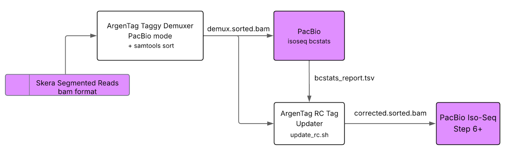

# ArgenTag single-cell read demultiplexing pipelines

Demultiplexing refers to the process of identifying the barcode(s) that each sequencing read from a given single-cell sequencing experiment is tagged with. Reads with common barcodes are assigned to the same cell. Currently, there are two alternatives for demultiplexing single-cell data generated on the ArgenTag platform:

+ **Customer-facing pipeline**. For users who want to maintain full control of their analysis or are otherwise unwilling or unable to disclose sequencing data (e.g. due to regulatory requirements), we provide a simplified standalone version of our software which can be run directly by users. This version of the pipeline is briefly described below, and example commands are provided.

+ **In-house single-cell pipeline**. This is the processing pipeline used internally by the ArgenTag team to process internally- and externally-generated data. Typically, users upload their data to ArgenTag's cloud servers, where it is processed by our team to generate demultiplexed read files along with reports and supplementary files. This pipeline is described on a [separate page](doc/in-house.md).

In either case, the main output of the pipeline is a set of demultiplexed, trimmed reads. These can be fed to a downstream analysis pipeline, including the [Iso-Seq pipeline](#pacbio-data-and-iso-seq-downstream-analysis-pipeline) (recommended for PacBio reads) and the [FLAMES-based downstream analysis pipeline](#ont-data-and-flames-based-downstream-analysis-pipeline) (recommended for ONT reads). Downstream analysis is covered here only briefly, but users are encouraged to see the provided [examples](#Examples-and-downstream-analysis) and the documentation for their tool of choice for further details.

## Customer-facing demultiplexing pipeline

For the customer-facing pipeline, the entire pipeline (except for an optional [chimera splitting step](#chimera-splitting)) is consolidated into a single binary to make it more user friendly. The input is a file of basecalled reads in sam or fastq format, while the output is a set of demultiplexed, trimmed reads in one of the [supported output formats](#output-formats).

### Usage
    
    Usage: taggy_demux [OPTION...] input-file
    taggy_demux -- a demultiplexer for ArgenTag reads
    
      -D, --max-edit-d=INT/FLOAT Maximum edit distance to consider for linker
                                 alignment (-1 means no limit). If float and < 1,
                                 intepreted as a relative maximum edit dist. If
                                 float and > 1, rounded down. [3]
      -f, --in-fmt=STRING        Format for input read file. Valid values are
                                 "fastq", "sam". [fastq]
      -F, --out-fmt=STRING       Format for output read file. Valid values are
                                 "flames", "fastq", "scnano", "sam". [flames]
      -h, --keep-header          Preserve SAM header in output. Only meaningful if
                                 --in-fmt=sam and --out-fmt=sam. [FALSE]
      -k, --keep-failed          Keep failed reads and set nb tag to -1. Only
                                 meaningful if --out-fmt=sam. [FALSE]
      -o, --output-dir=DIR       Output directory. [Current directory]
      -O, --orient=STRING        Orientation in which to output reads (one of
                                 "sense", "anti", "preserve" or "invert". [sense]
      -p, --trim-poly=STRING     Trim polyA/T from output sequences. Valid values
                                 are "none", "strict", "normal", "lenient". [none]
      -P, --preserve             Preserve tags in original sam record. Only
                                 meaningful if --in-fmt=sam and --out-fmt=sam.
                                 [FALSE]
      -R, --max-r-bases=INT      Maximum number of bases from read to align (-1
                                 means no limit) [-1]
      -t, --trim-TSO             Trim TSO (if found) from output sequences. [FALSE]
                                
      -T, --num-threads=INT      Use INT parallel threads [1]
      -u, --umi-start=INT        Use INT as UMI start coordinate. [25]
      -U, --umi-end=INT          Use INT as UMI end coordinate. [38]
      -w, --whitelist=FILE       Barcode whitelist file. [Default]
      -?, --help                 Give this help list
          --usage                Give a short usage message
    
    Mandatory or optional arguments to long options are also mandatory or optional
    for any corresponding short options.

### Output formats

#### FLAMES-style fastq format (`--out-fmt=flames`, default)
This is like the standard fastq format, except that read headers follow the following structure:

    @XXXX-YYYY-ZZZZ_UUUUUUUUUUUU#READID

* `XXXX`, `YYYY` and `ZZZZ` are the 3 barcodes which identify a specific cell.
* `UUUUUUUUUUUU` is the 12-nt UMI.
* `READID` is the original read ID.

An example could be
 
    @0076-0048-0089_ATACCGGCTACA#VH00444:319:AAFV5MHM5:1:1101:18421:23605

which would correspond to sequencing read VH00444:319:AAFV5MHM5:1:1101:18421:23605, which has been tagged with the barcode triplet (0076, 0048, 0089) and the UMI "ATACCGGCTACA".

#### Fastq format (`--out-fmt=fastq`)
This uses a standard fastq format, except that read headers follow the following structure:

    @BBBBBBBBBBBBBBBB_UUUUUUUUUUUU#READID

* `BBBBBBBBBBBBBBBB` is a unique 16-nt barcode which identifies a specific cell. This results from a mapping, so it will not appear verbatim in the original basecalled sequence.
* `UUUUUUUUUUUU` is the 12-nt UMI.
* `READID` is the original read ID.

An example could be
 
    @ACGTGCAGCAGACGGT_ATACCGGCTACA#VH00444:319:AAFV5MHM5:1:1101:18421:23605

which would correspond to sequencing read VH00444:319:AAFV5MHM5:1:1101:18421:23605, which has been tagged with the cell barcode "ACGTGCAGCAGACGGT" and the UMI "ATACCGGCTACA".

#### PB-style sam format (`--out-fmt=sam`)
This format follows the [SAM format specification](http://samtools.github.io/hts-specs/SAMv1.pdf) maintained by the SAM/BAM Format Specification Working Group, making use of the optional tags to encode additional information relevant to barcode demultiplexing and single-cell analysis. Consistency with the [PacBio BAM format specification](https://pacbiofileformats.readthedocs.io/en/13.0/BAM.html) is maintained whenever possible. In particular, the following tags are used:

| Tag	| Data type	| Description				|
| ----- | -------------	| -----------				|
| CB	| Z		| Corrected cell barcode.	|
| CR	| Z		| Raw (uncorrected) cell barcode. |
| rc	| i		| Predicted real cell. This is 1 if a read is predicted to come from a real cell and 0 if predicted to be a non-real cell. |
| XM    | Z             | Raw (after tag) or corrected (after correct) UMI. |
| XA    | Z             | Order of tags names. |

Note that the above does not preclude the presence of other tags added by third-party tools, which will be preserved to the largest extent possible.

An example SAM entry (line) is shown below:

    molecule/0      4       *       0       255     *       *       0       0       GGCAYTCATG[...]CGATGGCTAG *       CB:Z:AACCAAGGAGGTAGAT   XA:Z:XM-CB      XM:Z:CGCGACTGTTCT       ic:i:1  im:Z:m84112_240530_215351_s2/139986042/ccs/40_4082      is:i:1  it:Z:CGCGACTGTTCTAACCAAGGAGGTAGAT       rc:i:1  RG:Z:e4927d21   zm:i:0

<!--

#### PB-style bam format (`--out-fmt=bam`)
This is the binary version of the above [PB-style sam format](#pb-style-sam-format---out-fmtsam), and should be equivalent to using `--out-fmt=sam` followed by sam-to-bam conversion with a third-party tool.

-->

#### scNanoGPS-style fastq format (`--out-fmt=scnano`)
This is like the standard fastq format, except that read headers follow the following structure:

    @READID_UUUUUUUUUUUU

* `READID` is the original read ID.
* `UUUUUUUUUUUU` is the 12-nt UMI.

An example could be
 
    @VH00444:319:AAFV5MHM5:1:1101:18421:23605_ATACCGGCTACA

which would correspond to sequencing read VH00444:319:AAFV5MHM5:1:1101:18421:23605, which has been tagged with the UMI "ATACCGGCTACA".

For this format, the barcode is not included in the content of the fastq file, but is instead provided in the file name (one file per barcode combination/cell).

## Chimera splitting

As an optional step before demultiplexing, reads can be run through the `split.sh` bash script to split common chimeric reads. The script takes a fastq file as input and produces a new fastq file where reads with common chimeras have been splitThis will be incorporated into the main binary in future releases.

### Usage

The basic command for running the chimera splitting script is the following:

    bin/split.sh -i <path_to_input.fastq> -o <path_to_output.fastq>

These and other options are shown below:

    i: Input fastq file.
    o: Output fastq file.
    s: Process only this many reads.
    m: Filter reads smaller than this value.
    M: Filter reads larger than this value.
    G: Use a custom tmp folder. The default is to create via `mktemp -d`.
    C: Use a custom config file.
    R: Use a custom round setup.
    c: Use a custom prefix.
    t: Use this many threads. The default is the number of processors (as reported by nproc) minus one.
    E: Use this maximum edit distance when searching for chimeras. Higher values mean less stringency (more true positives, but also more false positives). An integer is interpreted as an edit distance. A real value < 1 is interpreted as a relative edit distance. The default is 0.12 (12%).
    d: Run in debug mode.
    p: Preserve temporary files instead of deleting.

Processing multiple input files is currently handled externally:

    for inputfile in <path_to_input_files>/*.fastq; do bin/split.sh -i "$inputfile" -o "$inputfile".split; done

# Examples and downstream analysis

## PacBio data and Iso-Seq downstream analysis pipeline

For data generated on the PacBio platform, we recommend using the SAM input format (`--in-fmt=sam`), as well as the PacBio-compatible SAM format (`--out-fmt=sam`). Conversion from SAM to BAM and viceversa can be handled via samtools (ideally in place, via process substitution):

### Example commands
    #Convert S-read bam file to sam in place via process substitution, and run demux binary
    NUM_THREADS=32
    bin/taggy_demux -T "$NUM_THREADS" -o "$OUT_DIR" --orient sense --in-fmt=sam --out-fmt=sam --preserve --trim-TSO --trim-poly normal --keep-header <(samtools view -h segmented.bam)
    #Convert demultiplexed sam output back to bam
    samtools view -bS "$OUT_DIR"/demux.sam > "$OUT_DIR"/demux.bam

### RC tag updating

Described [here](doc/update_rc.md)

### Iso-Seq downstream analysis pipeline

The output from the previous commands is compatible with the [Iso-Seq pipeline, starting from the deduplication step (Step 6)](https://isoseq.how/umi/cli-workflow.html#step-6---deduplication)

## ONT data and FLAMES-based downstream analysis pipeline

For data generated on the ONT platform, we recommend running the optional [chimera splitting step](#chimera-splitting) and outputting in the FLAMES-compatible fastq format (`--out-fmt=flames`) for direct compatibility with our [FLAMES-based downstream analysis pipeline](#FLAMES-based-downstream-analysis-pipeline).

### Example commands

    #Split chimeras (optional, see "Chimera splitting" below)
    bin/split.sh -i "$INPUT_FASTQ_FILE" -o "$DECHMIERIZED_FASTQ_FILE"
    #Run with 8 threads
    mkdir "$OUT_DIR"
    bin/taggy_demux -T 8 --in-fmt=fastq --out-fmt=flames -o "$OUT_DIR" -s "$DECHMIERIZED_FASTQ_FILE"

### FLAMES-based downstream analysis pipeline

The output from the previous commands can then be analyzed with our [FLAMES-based downstream analysis pipeline](https://github.com/argentagsw/at_flames)
