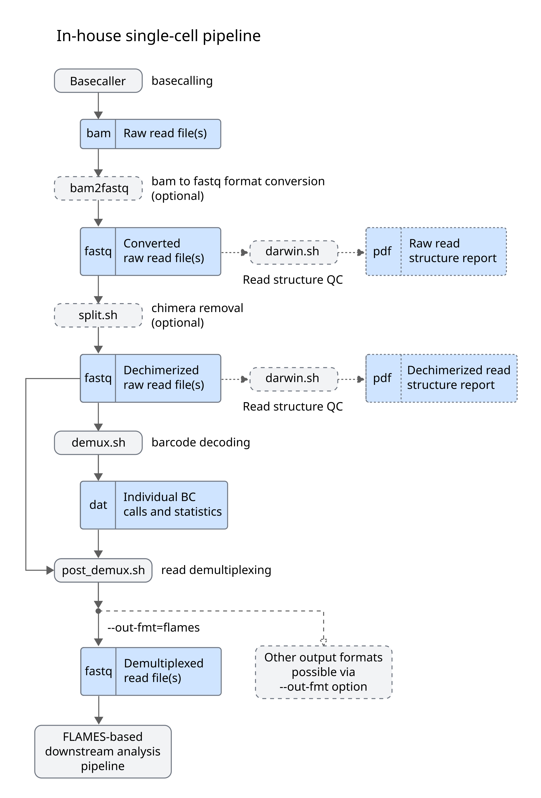

# ArgenTag single-cell read demultiplexing pipelines

Demultiplexing refers to the process of identifying the barcode(s) that each sequencing read from a given sequencing experiment is tagged with. Reads with common barcodes are assigned to the same cell. Currently, there are two alternatives for demultiplexing single-cell data generated on the ArgenTag platform:

* **In-house single-cell pipeline**. This is the processing pipeline used internally by the ArgenTag team to process internally and externally generated data. Typically, users upload their data to ArgenTag's AWS servers, where it is processed by our team to generate demultiplexed read files along with reports and supplementary fi This pipeline is described below.

+ **Customer-facing pipeline**. For users who are unwilling or unable to disclose sequencing data (e.g. due to regulatory requirements), we also provide a simplified standalone version of our software which can be run directly by users. This version of the pipeline is described on a [separate page](README.md).

In either case, the main output of the pipeline is a set of demultiplexed, trimmed reads, which can be fed to a downstream analysis pipeline (e.g. the [FLAMES-based downstream analysis pipeline](#FLAMES-based-downstream-analysis-pipeline)). Downstream analysis is covered here only briefly, but users are encouraged to see the documentation for their tool of choice for further details.

## In-house demultiplexing pipeline

As mentioned above, this pipeline is not customer-facing, so no commands are given below, but an overall description of the process is given to aid the user in understanding the data analysis performed by the ArgenTag team and make sense of the provided output files.

### bam2fastq

The input to the demultiplexing pipeline is a set of basecalled reads. These are typically the output of the ONT Dorado basecaller (either "hac" or "sup" accuracy modes) or the basecalled output of a PacBio Kinnex Skera experiment.
The following step expect reads to be in the fastq format, so, for basecallers which produce bam output, initial conversion to fastq is required. This can be readily achieved with gnutils, samtools and/or dedicated tools.

### darwin.sh

This in-house tool screens the overall structure of (a sample of) sequencing reads to identify groups with a common structure in terms of barcodes and adapters ("species").
It generates a species report which can be visually inspected as a form of QC and to identify common library artifacts, including chimeric reads.

### split.sh

If chimeric reads are detected, split.sh can be optionally run to split them and generate dechmierized raw read files, suitable for demultiplexing.
The darwin tool can optionally be run again and a second report generated to check for successfull chimera splitting (dechmierization).

### demux.sh

This is the core demultiplexing tool.
* Uses a one-shot mathematical decoding algorithm to detect and identify BC triplets in individual reads.
* Operates autonomously, without requiring complementary short reads.
* Scales efficiently with respect to the number of BC triplets, avoiding exhaustive alignment to external whitelists.
* Generates a matrix of barcode calls with their corresponding confidence values (.dat).
* Further details on ArgenTag barcoding tech are available [here](https://pubmed.ncbi.nlm.nih.gov/27259539/).

### post\_demux.sh

This final step takes the matrix of barcode calls and confidence values and applies sanity checks and filtering criteria to remove dubious barcode calls, untagged molecules, unligated adapters and other unwanted reads. Generates fastq files with confident associations of transcript reads to BC triplets, ready for downstream analysis (e.g. with the [FLAMES-based downstream analysis pipeline](#FLAMES-based-downstream-analysis-pipeline)).

