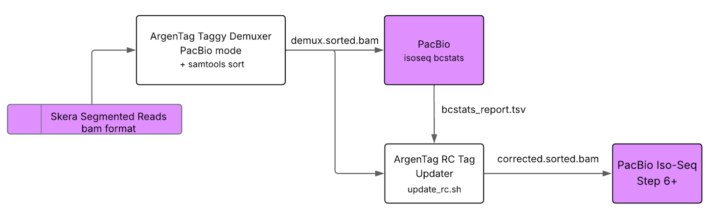

# Updating of the `rc` tag (`update_rc.sh`)

The demultiplexed read file generated by `taggy_demux` (`demux.sam/bam`) has the `rc` tag set to `1` for *all* reads because the tool does *not* perform background RNA filtering (elbow plot analysis). If their downstream processing pipeline does not include background RNA filtering, users can follow this short guide to update the `rc` tag based on their desired criterion by leveraging `isoseq bcstats` and the provided [convenience script](../bin/update_rc.sh).

**Note:** Replace all `/path/to/` placeholders with your actual file paths before running the commands.

## Setup Environment

### Create a new environment using the [provided environment file](../res/AT2PB.conda_env.yml):

    conda env create -f res/AT2PB.conda_env.yml
    conda activate at2pb_isoseq

### Verify installation:

    samtools --version # Expect: samtools 1.20+
    python --version # Expect: Python 3.10-3.12

### Make the script executable if needed:

    chmod +x bin/update_rc.sh

## Run Workflow

### 1. Sort demux BAM by cell barcode

    DEMUX="/path/to/demux.bam"
    DEMUX_SORTED="/path/to/demux.sorted.bam"
    samtools sort -t CB $DEMUX -o $DEMUX_SORTED

### 2. Run `isoseq bcstats` for cell calling (knee based by default)

    BCSTATS_TSV="/path/to/bcstats_report.tsv"
    BCSTATS_JSON="/path/to/bcstats.json"
    # Get isoseq knee cell calling information in bcstats_report.tsv file
    isoseq bcstats -o $BCSTATS_TSV --json $BCSTATS_JSON $DEMUX_SORTED
    
### 3. (Optional) Perform graphical analysis of knee cell calling with PacBio `plot_knees.py` script
    # Generate elbow plots to visualize knee-based cell calling
    python plot_knees.py $BCSTATS_TSV

### 4. Update the rc tag using provided script

If knee cell calling is satisfactory, update the `rc` tag using provided `update_rc.sh` script:

    OUTPUT="/path/to/corrected.sorted.bam"
    NUM_THREADS=8
    # Apply isoseq cell calling to demux sorted BAM
    bin/update_rc.sh -i $DEMUX_SORTED -b $BCSTATS_TSV -o $OUTPUT -t "$NUM_THREADS" -v

## Key Arguments

    -i: Input sorted BAM with CB tags (ArgenTag corrected)
    -b: bcstats TSV file from isoseq bcstats
    -o: Output sorted BAM file with correct CB includes rc:i:1 for cells, rc:i:0 for non-cells
    -t: Number of threads (default: 4)
    -v: Verbose output

## Notes

* Output BAM ready for isoseq groupdedup
* Supports any isoseq bcstats percentile method
* Use conda deactivate when finished
